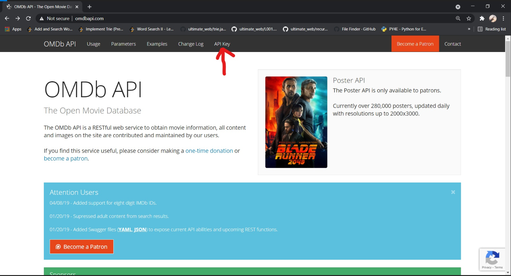
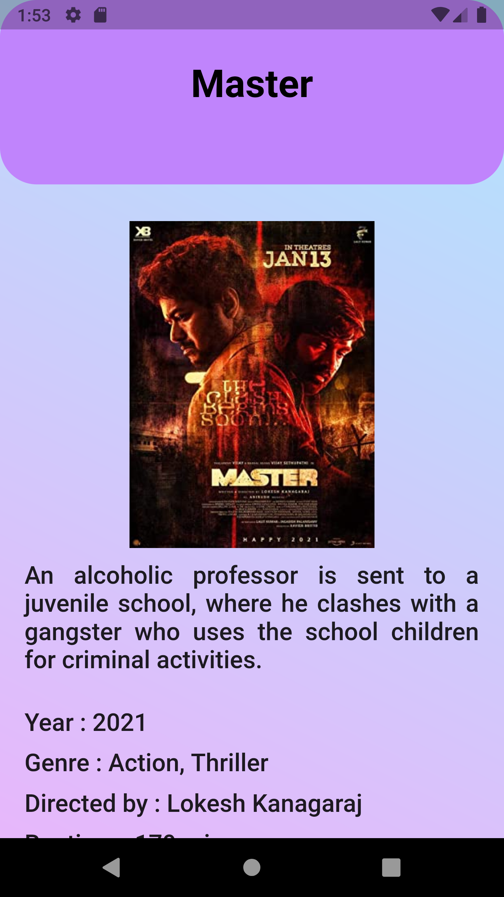

# MOVIE SEARCH APP


A Movie Search Application built with Flutter.

## Table of content

  - [Getting Started](#getting-started)
  - [Project Info](#project-info)
  - [How to Run](#how-to-run)
  - [Project Output](#project-output)
  - [Technology Used](#technology-used)
  - [Get Help](#get-help)


## Getting Started
This project is a beginner-friendly application for searching Movies.

Clone the repository and use it in your local system
```console
git clone https://github.com/codemike513/FLUTTER-MOVIE-SEARCH-APP.git
```
For this project, Flutter should be installed in your system.
If you haven't installed Flutter, just check out this [official documentation](https://flutter.dev/docs/get-started/install) and get started.

---

## Project Info
This Project basically uses an API to scrap data for various Movies.
In this Project **[Lottie Animations](https://lottiefiles.com/)** are used and **[OMDb API](http://www.omdbapi.com/)** is used.

You can get the API KEY by just entering your E-Mail.





Change the API_KEY in the [movieService](./lib/services/movieService.dart) file to your own API_KEY.

---

## How to Run
  - Clone the Repository.
  - Change the Directory to specified folder.
  
  ```console
  cd FLUTTER-MOVIE-SEARCH-APP
  ```
  
  - Now start the Emulator and run the command in the terminal.
  
  ```console
  flutter run
  ```

---

## Project Output




---
## Technology Used
  - Flutter
  - Dart

## Get Help
- Contact me at pesswani.mihir@gmail.com
- If appropriate, [open an issue](https://github.com/codemike513/FLUTTER-MOVIE-SEARCH-APP/issues) on GitHub